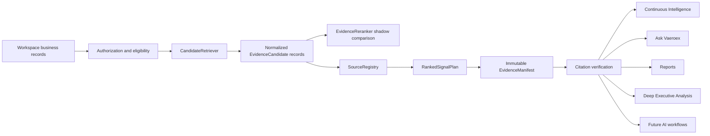

# ADR-001: Vaeroex Evidence Engine

- Status: Accepted
- Date: 2026-07-19
- Decision owners: Vaeroex platform engineering
- Scope: Shared evidence retrieval and verification infrastructure

## Context

Vaeroex has several intelligence consumers with different response depths and model requirements:

- Continuous Intelligence
- Ask Vaeroex
- Reports
- Deep Executive Analysis
- future AI workflows

Generation providers and models will change over time. The quality, isolation, provenance, and lifecycle integrity of business evidence must not change with them. Evidence handling therefore belongs to the Vaeroex platform, not to any generation provider.

## Decision

Vaeroex will maintain a provider-neutral platform layer named the **Vaeroex Evidence Engine**.

The Evidence Engine owns:

- workspace authorization
- evidence eligibility
- lifecycle state
- source identity
- source independence
- provenance
- retrieval budgets
- signal ranking
- confidence ceilings
- citation creation
- citation verification
- immutable evidence manifests
- derived-output exclusion

Generation models may summarize or reason over an approved evidence manifest. They may not determine or override any responsibility listed above.

The first implementation slice introduces contracts and adapters around the existing Supabase and pgvector retrieval path. It does not change active ranking, routing, database state, or user-facing behavior. NVIDIA reranking runs only in explicit shadow evaluation mode, and its order is never applied to an active response in this slice.

## Architecture

## Permanent Provider-Neutral Contracts

All contracts are explicitly versioned. Additive optional fields may be introduced within a version only when older readers remain correct. Semantic or required-field changes require a new version.

### EvidenceQuery

Defines the server-authorized evidence request:

- contract version
- workspace ID
- question text
- required domains
- retrieval strategy
- candidate and result budgets
- requested source diversity
- optional freshness boundary

Workspace ID and authorization context remain server-side and are never delegated to a model.

### EvidenceCandidate

Represents one normalized, already-eligible retrieval candidate:

- contract version
- candidate and workspace identity
- domain and record type
- bounded title, excerpt, and summary
- source and parent-source lineage
- application-calculated evidence role and independence key
- lifecycle and eligibility decision
- quality, confidence, and recorded time
- retrieval method, score, and deterministic base rank

Candidates with an ineligible decision cannot enter a manifest or reranker request.

### SourceRegistry

Provides one workflow-wide source identity map:

- source ordinal
- canonical source key
- application-calculated independent source key
- source type and readable title
- original, supporting, derived, or historical role
- candidate membership
- source-file and parent lineage

Multiple chunks or structured rows from the same original source remain one independent source. Supporting Business Memory chunks do not become additional independent original sources.

### RerankResult

Records a bounded adapter result:

- contract version
- provider, model, and adapter version
- success, skipped, or failed status
- ordered candidate ordinals and scores
- input count, token usage, latency, and content-free failure code
- whether the result was shadow-only

A reranker can change only candidate relevance order. It cannot change eligibility, source identity, source independence, confidence, or citations.

### RankedSignalPlan

Defines deterministic signal candidates after evidence ranking:

- contract version
- plan identity and evidence-manifest identity
- signal IDs and ranks
- domains
- supporting citation IDs
- independent-source counts
- confidence ceilings
- explicitly permitted relationships
- required signal coverage

Signal planning remains Vaeroex application behavior.

### EvidenceManifest

Freezes the exact evidence package available to a workflow:

- contract version and immutable manifest ID
- workspace and query fingerprints
- creation time
- ordered evidence entries with application-generated citation IDs
- source registry snapshot
- retrieval, embedding, reranker, signal-plan, and citation-verifier versions
- derived-output exclusion policy

The manifest is deeply immutable at runtime. A changed eligible-evidence fingerprint creates a new manifest rather than mutating an old one.

### CitationVerificationResult

Records deterministic verification of generated citation references:

- contract and verifier version
- validity
- verified citation IDs
- unknown, duplicated, missing, ineligible, or lineage-invalid references
- expected and observed counts

Verification never asks a generation model whether its own citation is valid.

## Adapter Boundaries

### CandidateRetriever

`CandidateRetriever` receives an authorized `EvidenceQuery` and returns normalized eligible candidates within deterministic budgets.

Initial implementation:

- current Supabase and pgvector retrieval path
- current keyword fallback
- current embedding provider behavior
- current lifecycle and parent-eligibility checks

Future adapters may add hybrid retrieval or versioned embeddings without changing consumers.

### EvidenceReranker

`EvidenceReranker` receives only the already-eligible bounded candidates and returns candidate ordinals and relevance scores.

Initial implementations:

- deterministic no-op reranker
- NVIDIA `llama-nemotron-rerank-1b-v2` shadow adapter

Future implementations may include other provider-neutral text rerankers and a separately qualified multimodal reranker.

## Invariants

1. Workspace authorization and evidence eligibility run before retrieval result limits.
2. No candidate from another workspace may enter a retrieval result, source registry, manifest, reranker request, or citation catalog.
3. Inactive, archived, deleted, orphaned, setup-only, platform-failure, and generated-ineligible records are excluded.
4. A parent-linked record is ineligible when its parent is missing or ineligible.
5. Derived intelligence never becomes original evidence or increases original-source coverage.
6. Citation IDs are created by Vaeroex application code.
7. Citation validity is checked against the immutable manifest by Vaeroex application code.
8. Source identity and source independence are calculated by Vaeroex application code.
9. Provider failure fails open to the current eligible deterministic order.
10. Reranker output cannot add, remove, or mutate evidence.
11. Vectors created by different embedding model versions are never mixed implicitly.
12. Retrieval and reranking budgets remain deterministic and bounded.
13. Telemetry is content-free. It may contain versions, counts, timings, scores, status, and reason codes, but not questions, excerpts, prompts, responses, workspace IDs, record IDs, or customer data.
14. Shadow evaluation cannot affect active workflow output.

## Consumer Guarantees

### Continuous Intelligence

Receives bounded, validated evidence and deterministic source, freshness, confidence, and citation metadata. Cached derived intelligence remains ineligible as original evidence.

### Ask Vaeroex

Receives a query-appropriate immutable manifest. Search behavior, synchronous provider policy, citation validation, and existing response-depth routing remain separate from retrieval adapters.

### Reports

Receives only eligible evidence with deterministic original-source counts. Derived reports cannot cite themselves as original evidence or increase Coverage or Business Health.

### Deep Executive Analysis

Will receive a frozen evidence manifest suitable for asynchronous execution and reproducible follow-ups. Sprint 5 job orchestration is not part of this decision's first implementation slice.

## Versioning and Migration Rules

### Normalized Evidence Contracts

- Every serialized contract carries a literal version.
- Breaking field or semantic changes create a new contract version.
- Consumers must reject unknown major versions rather than guessing.
- Adapters normalize provider-specific responses at the boundary.

### Evidence Manifests

- Manifest IDs are deterministic hashes of the authorized query fingerprint, ordered evidence identities, source registry, and component versions.
- Existing manifests are never rewritten when evidence or a component version changes.
- A new eligibility, citation-verifier, or source-registry version creates a new manifest.

### Embedding Versions

- Existing active embeddings remain unchanged in this slice.
- A future embedding model receives a separate explicit version and shadow index.
- Different dimensions or model versions are never written to or queried as one implicit vector population.
- Promotion requires dual-read evaluation, controlled reindexing, rollback, and lifecycle parity.

### Reranker Versions

- Each result records adapter and model versions.
- Shadow and active modes are distinct policies.
- Model promotion requires benchmark approval; changing an environment variable alone is insufficient.
- Reranker failure always preserves deterministic eligible order.

### Citation Verification Versions

- Verification rules carry a verifier version.
- A verifier change invalidates cached validation results but does not rewrite historical manifests.
- Historical outputs retain the verifier version used when they were accepted.

## Observability

The Evidence Engine emits a hierarchical, content-free decision trace. Allowed fields include:

- workflow and component version
- stage and status
- candidate, source, and citation counts
- retrieval mode
- provider and model identifiers
- latency and token usage
- fallback use
- bounded reason codes

Questions, evidence text, prompts, model responses, workspace IDs, record IDs, source IDs, and API keys are prohibited from telemetry.

## Qualification Gate for NVIDIA Reranking

NVIDIA reranking remains shadow-only unless frozen-fixture and Preview evaluation demonstrates:

- zero lifecycle leakage
- zero workspace leakage
- no material Recall@20 regression
- no citation-precision regression
- no unsupported-claim increase downstream
- measurable nDCG@10, Precision@10, MRR, or source-diversity improvement
- acceptable added p95 latency and cost
- correct fail-open behavior for timeout, rate limit, unavailable, and malformed responses

Promotion is a separate architecture and release decision.

## Deferred Scope

This ADR does not authorize:

- active routing changes
- UI changes
- database schema changes or migrations
- Production rollout
- self-hosted NVIDIA NIM
- multimodal reranking
- embedding replacement or reindexing
- Continuous Intelligence generation expansion
- Sprint 5 asynchronous jobs
- changes to Sprint 3 reasoning or provider order

## Consequences

Positive consequences:

- retrieval improvements benefit every intelligence workflow
- generation providers remain replaceable
- lifecycle, provenance, and citation rules stay stable across models
- shadow qualification is possible without risking active output
- evidence manifests make future asynchronous analysis reproducible

Costs and tradeoffs:

- provider responses require normalization and stricter adapter tests
- component and contract versions add operational metadata
- embedding changes require explicit side-by-side indexes and migrations
- reranking adds latency and cost that must earn promotion through measured quality gains
