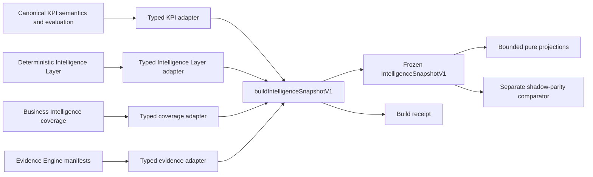

# ADR-002: Canonical Intelligence Contract V1

- Status: Accepted for foundation implementation
- Date: 2026-07-28
- Baseline: `c5739c073d4796940b93964318f90ac1230e8504`
- Scope: Provider-neutral, deterministic intelligence snapshot foundation

## Context

Vaeroex already has authoritative deterministic producers for KPI meaning, KPI performance, Business Health, findings, priorities, data quality, readiness, coverage, and evidence ownership. Those producers remain authoritative. This decision adds one versioned object after those calculations so future consumers can read the same bounded representation without recreating formulas or semantic meaning.

This foundation does not migrate a customer-facing consumer. It performs no database access, persistence, model call, provider routing, or deterministic calculation.

## Decision

`IntelligenceSnapshotV1` is the canonical, immutable representation of already-produced deterministic intelligence. Typed adapters may copy and normalize producer shapes only. `buildIntelligenceSnapshotV1` validates producer identity, workspace and cutoff consistency, orders the adapted values, computes fingerprints, validates the runtime schema and invariants, and deep-freezes the result.

Build diagnostics are returned separately in `IntelligenceSnapshotBuildReceiptV1`. Shadow differences are returned separately in `ShadowParityReportV1`. Neither structure is business intelligence or part of the semantic fingerprint.



## Producer Map

| Producer | Accepted ID and version | Adapted fields | Explicitly not recalculated |
| --- | --- | --- | --- |
| Intelligence Layer | `intelligence_layer` / `intelligence_layer_v1` | Business Health result, data quality, forecast readiness, deterministic findings, priorities, supporting-record identity | Business Health formula, findings, priorities, confidence |
| KPI semantics | `canonical_kpi_semantics` / `kpi_semantics_v1` | Canonical identity, confirmed semantics, manual/configured/effective targets, recommendation, evaluation, freshness, bounded observations | Semantics, target selection, recommendation, performance |
| Coverage | `business_intelligence_coverage` / `business_intelligence_coverage_v1` | Overall and category coverage, confidence, evidence counts | Coverage or readiness calculations |
| Evidence Engine | `evidence_engine_manifest` / `evidence_manifest_v1` | Bounded source identity, authority role, lifecycle, lineage, policy versions, citation identity | Eligibility, source independence, ranking, citations |

Every producer is wrapped in `IntelligenceProducerEnvelopeV1` with `workspaceId`, `asOf`, an allowlisted producer ID/version, and its semantic input fingerprint. The caller is responsible for producing that fingerprint from semantic inputs only. Presentation labels, prose, order, telemetry, and wall-clock build time must not enter it.

## Current Consumer Map

Business Health explanation is the first live consumer. Its authorized Executive Overview composition boundary builds `IntelligenceSnapshotV1`, selects the bounded Business Health explanation projection, and preserves the existing explanation package and generation service. Intelligence, KPI pages, Explain Finding, People/Prestige, Reports, Saved Analyses, and every other generation service continue using their existing paths unchanged.

The original foundation defined these unconnected pure projections for staged migration:

- `ExecutiveOverviewProjectionV1`
- `IntelligenceInboxProjectionV1`
- `KpiOverviewProjectionV1`
- `BusinessHealthExplanationProjectionV1`
- `FindingExplanationProjectionV1`
- `ExecutiveReasoningProjectionV1`

The temporary People/Prestige projection was removed when those legacy customer surfaces were retired.

## Contract Schema

`IntelligenceSnapshotV1` contains:

```text
contract
  id: intelligence_snapshot_v1
  version: 1.0.0
  schemaVersion: 1
scope
  workspaceId
  asOf
  evaluationDate
versions
  calculations: kpiSemantics, intelligenceLayer, businessHealth,
                dataQuality, forecastReadiness, coverage
  policies: evidenceEligibility, lineage, freshness, ordering
  adapters: intelligenceLayer, kpis, coverage, evidence
fingerprints
  input
  snapshot
businessHealth: SnapshotState<score, canonical status, canonical trajectory,
                              confidence, component state>
dataQuality: SnapshotState<score, canonical label, confidence>
readiness
  forecast: SnapshotState<concrete forecast readiness>
  coverage: SnapshotState<concrete coverage result>
kpis[]
  id
  identity: canonicalName, displayName, originalSourceLabel, unit, scale, metricRole
  semantics: SnapshotState<canonical desired direction, target behavior,
                           semantic target fields, classification provenance>
  manualTarget
  configuredSemanticTarget
  effectiveAuthoritativeTarget
  recommendationAvailability
  recommendedNextTarget
  observations: current, previous, range start, bounded selected range
  performance: SnapshotState<canonical movement, effect, trend, target status, values>
  freshness: SnapshotState<canonical status, age, latest measurement>
  evidenceReferenceIds[]
findings[]
  one canonical identity and payload
  origin: deterministic
  allowlisted producer ID/version
  canonical type, priority, confidence
  existing deterministic-template presentation
  deterministic KPI/evidence dependency IDs
  citation IDs
findingIndex
  riskFindingIds, opportunityFindingIds, recommendationFindingIds,
  forecastFindingIds
priorities[]
  role, rank, findingId
evidence
  references[]: identity, authority role, active lifecycle, lineage,
                eligibility and policy metadata only
  citations[]: citation identity and evidence reference
  sourceRegistryVersions[]
limitations[]
provenance[]
  producer ID/version, workspaceId, asOf, semantic input fingerprint
```

All runtime objects are strict Zod schemas. Existing repository types define KPI direction, target behavior, movement, performance effect, range trend, target status, freshness, recommendation confidence, finding type, confidence, Business Health status/trajectory, forecast readiness, and coverage categories.

`SnapshotState<T>` explicitly distinguishes `available`, `unavailable`, `unresolved`, `insufficient_data`, `not_applicable`, and `unknown_semantics`. No `SnapshotState<unknown>` is permitted.

## Target Authority

The contract keeps four concepts separate:

1. `manualTarget` records the persisted user target when present.
2. `configuredSemanticTarget` records a confirmed semantic ideal or range.
3. `effectiveAuthoritativeTarget` records the existing producer's active target choice. A manual target must be preserved here with source `manual`.
4. `recommendedNextTarget` records an unapplied deterministic recommendation and its availability.

`KpiTargetReference` cannot use `recommended` as an authoritative source. The builder rejects a manual target that is not the effective authoritative target. Unknown semantics cannot expose directional performance, a semantic target, or a recommendation; a separately persisted manual target remains visible without assigning directional meaning.

## Time Semantics

- `asOf` is the deterministic calculation cutoff shared by every supplied producer.
- `evaluationDate` is the explicit `YYYY-MM-DD` date used by upstream freshness evaluation when it differs from the timestamp cutoff.
- `generatedAt` is when this in-memory representation was built. It exists only on the build receipt and never changes semantic fingerprints.

The builder has no ambient date read. Time-sensitive producers must receive `asOf` and `evaluationDate` before their outputs are passed to it.

## Fingerprints

The input fingerprint hashes:

- contract identity;
- workspace, `asOf`, and `evaluationDate`;
- calculation, policy, ordering, and adapter versions;
- every producer ID/version/workspace/cutoff;
- every producer semantic input fingerprint.

The snapshot fingerprint hashes the canonical semantic snapshot, excluding its own fingerprint fields. It includes producer semantic input identity and the bounded deterministic output structure. It excludes:

- `generatedAt` and build receipt identity;
- adapter timings and serialized-size measurements;
- shadow differences;
- request IDs and telemetry;
- UI labels and colors;
- routes and component order;
- finding render wording;
- limitation prose;
- prompts, embeddings, raw evidence, and provider output.

Objects are key-sorted, semantic arrays are canonically ordered, and identity arrays are internally sorted before hashing. Input permutations therefore produce the same snapshot and fingerprints.

## Bounds

The base snapshot rejects payloads above these limits:

| Item | Limit |
| --- | ---: |
| KPIs | 200 |
| Selected-range observations per KPI | 6 |
| Findings | 100 |
| Priorities | 4 |
| Evidence references | 500 |
| Citations | 1,000 |
| Limitations | 100 |
| Source IDs per evidence reference | 8 |
| Lineage IDs per evidence reference | 16 |
| KPI dependencies per finding | 16 |
| Evidence dependencies/citations per finding | 24 |
| Source registry versions | 16 |
| Labels | 256 characters |
| Deterministic presentation fields | 4,000 characters each |

The executive-reasoning projection is further capped at 12 KPIs, 12 findings, 24 evidence references, and 12 limitations. Evidence references never contain excerpts, raw source text, prompts, embeddings, or unrestricted generated prose.

## Invariants

Construction fails when any invariant is violated:

1. Producer ID/version is unsupported, its workspace differs, or its `asOf` differs.
2. A KPI, manifest, source registry, or evidence reference belongs to another workspace.
3. KPI IDs or canonical identities collide; identity includes canonical name, role, scale, and unit so intentionally scaled metrics remain distinct.
4. An observation cap is exceeded, IDs repeat, or producer evaluation values disagree with the supplied current/previous/range-start observations.
5. Unknown semantics expose directional performance, a semantic target, or a recommendation.
6. A manual target is not preserved as the effective authoritative target.
7. A configured semantic target has a manual source, a range is inverted, or recommendation availability conflicts with recommendation state.
8. Finding IDs/fingerprints collide, a finding is not deterministic, or its producer is not allowlisted.
9. Priorities, finding indexes, finding dependencies, KPI evidence IDs, or citations do not resolve exactly.
10. Evidence is inactive, foreign, duplicated, or exceeds bounds.
11. Saved Analysis content is presented as evidence.
12. Supporting context, including Business Notes, is promoted to original authority or marked original-evidence eligible.
13. A manifest source ordinal, candidate mapping, candidate membership, or evidence role disagrees with its source registry.
14. Scores exceed canonical bounds or fingerprints do not match canonical content.

The builder validates workspace consistency but does not perform authorization or query data. Callers remain responsible for obtaining all producer outputs through existing server-side membership, RLS, lifecycle, and release-channel controls before construction.

## Build Receipt Boundary

`IntelligenceSnapshotBuildReceiptV1` contains only build metadata:

- receipt ID and snapshot fingerprint;
- workspace ID;
- `generatedAt` and builder version;
- validation status and invariant count;
- adapter versions;
- total, adapter, ordering, validation, hashing, and serialization timings;
- bounded object counts and serialized byte size.

It is deeply frozen with the snapshot but is not nested inside it, is not evidence, is not projected to reasoning, and does not affect semantic fingerprints.

## Shadow Parity

`compareIntelligenceSnapshotV1` is a pure fixture/local comparator. It checks Business Health, data quality, forecast readiness, findings, priorities, KPI semantic outputs, coverage, and evidence identity against the supplied authoritative producer outputs. It can also report known legacy duplicate values without granting them authority.

Differences are classified as exact match, presentation only, ordering only, missing producer field, adapter defect, legacy duplicate, genuine deterministic disagreement, or unavailable for comparison. Blocking and fatal differences remain explicit; the comparator never chooses a winner and its report never enters the snapshot.

The authoritative Intelligence Layer now exposes its already-calculated Business Health score components and bounded driver impacts. The adapter copies those values without recreating the formula, and the fixture requires exact component parity.

## Staged Migration

1. Land this unconnected foundation and fixture-driven parity suite.
2. Add read-only construction at an existing authorized server boundary and compare in shadow mode.
3. Resolve any blocking parity difference in the authoritative producer or adapter; never in a consumer-specific formula.
4. Migrate one consumer at a time to a bounded projection, retaining rollback to its existing path.
5. Remove duplicated consumer calculations only after parity and human review.

Saved Analyses remain historical copied artifacts and are never producer or evidence inputs. ADR-005 retires the former non-authoritative parallel intelligence source without broadening this contract.

## Persistence Decision

No database change is required. This foundation creates no table, migration, cache, RPC, RLS policy, or persistent source of truth. Persistence would introduce a second lifecycle and is deferred unless a future approved consumer demonstrates a concrete need.

## Consequences

- Future consumers can converge on one deterministic representation without changing formulas.
- Cross-workspace and evidence-authority mistakes fail closed at the contract boundary.
- Payload and provider context growth remain bounded.
- Missing producer fields stay visible instead of being guessed.
- Producer semantic fingerprints become a required caller contract.
- Business Health explanation is the only approved live consumer migration; its customer-visible contract and presentation remain unchanged.
