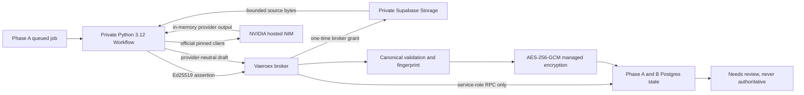

# Document Extraction Private Worker - Phase B

## Status

Phase B is a disabled execution foundation. It does not activate document extraction, entitle a workspace, enqueue customer files, add review UI, or permit an NVIDIA call by default. Phase A remains the canonical persistence, quota, review, and authority foundation.

## Hosting decision

The worker is packaged as a separate Python 3.12 Vercel Workflow project. A Workflow step can outlive an inbound request, Vercel provides durable execution and deployment rollback, and a separate project keeps the large NeMo Retriever dependency and worker secrets outside the customer-facing Next.js bundle.

The separate project must use Vercel Deployment Protection, a dedicated project identity, one-run concurrency controls, and the narrow broker origin. The worker project is not deployed by this PR. Phase C must verify those project controls before any pilot activation.

The Python package declares `vaeroex_document_worker.workflow:workflows` as its Vercel Workflow entrypoint. The single job step sets Workflow-level retries to zero; retry eligibility is owned only by the durable broker state machine.

Rejected alternatives:

- A normal Vercel Python Function is request-duration bound and is not the durable job runner.
- A Supabase Edge Function uses Deno and cannot run the pinned official Python client.
- Adding Python to the active Next.js project would broaden its deployment and secret boundary.
- A new container platform would add an unapproved infrastructure and operations surface when a connected durable workflow target exists.

## Topology



## Trust boundaries

### Worker

The worker receives only its Ed25519 private identity, the NVIDIA credential, the protected broker origin, and exact approved provider revisions. It refuses to start if a Supabase service-role key or document-cache encryption key is present. It has no database or bucket credential.

### Broker

The Next.js broker verifies every worker request, consumes its nonce in the replay ledger, verifies lease/file capabilities, and calls service-role-only security-definer RPCs. Caller-supplied workspace and file identities are never accepted. The broker is hard-disabled unless the private-worker switch is true.

The broker alone:

- resolves workspace, job, file, and cache identity;
- obtains an internal 30-second storage URL;
- proxies source bytes through a single-use grant;
- validates and fingerprints the provider-neutral artifact;
- builds the critical-field manifest;
- encrypts normalized content; and
- writes encrypted cache metadata through the Phase B completion RPC.

The normalization boundary is an exact-key allowlist at the artifact, page, block, critical-field, coordinate, and validation-finding levels. Unknown provider metadata and raw provider response fields are rejected rather than encrypted or retained.

### Database

RLS is enabled on replay, file-grant, and telemetry tables. Client roles and `service_role` receive no direct table privileges. Only the exact service-role RPCs have execution grants. Operational telemetry is append-only. Phase A review and authority guards are unchanged.

## Worker identity and broker protocol

Every request carries:

- broker protocol version;
- worker and key versions;
- Unix timestamp;
- a random 128-bit nonce;
- SHA-256 body digest; and
- an Ed25519 signature over method, request target, digest, identity, timestamp, and nonce.

Assertions expire after 60 seconds. The database atomically rejects replayed worker/key/nonce tuples. A successful claim returns an HMAC-signed lease capability containing only the job, worker, and expiry. File access uses a separate random, HMAC-signed, single-use capability. Neither token carries a reusable storage credential.

## Job lifecycle

The NVIDIA-only V2 claim enforces exact model, parser, client revision, file size, page count, review requirement, route, and all Phase A gates before leasing.

Allowed worker transitions are:

```text
queued -> leased -> preparing -> dispatching -> provider_dispatched
       -> extracting -> normalizing -> validating -> encrypting
       -> awaiting_review
```

Only a later authorized Phase A review can move the artifact through classification and promotion to completed authority. The worker cannot skip stages. A pre-dispatch expired lease may be reclaimed. An expired lease after `provider_dispatched` becomes `dispatch_unknown` and is never automatically retried.

Any transition to `dispatch_unknown`, including lease expiry after a provider dispatch, opens the durable provider circuit through a database trigger. This closes the crash path that cannot report a normal provider outcome and requires controlled operator recovery.

## Signed file access and cleanup

The worker asks for a single-purpose grant while holding a valid lease. The broker atomically consumes the grant, derives the stored workspace path from the job, creates a 30-second signed URL internally, and proxies no more than 25 MB. The signed URL is never returned to Python or stored.

Temporary directories use mode `0700`; files use `0600`. The source is removed after provider input preparation. The whole directory is removed on success, exception, timeout, SIGINT, and SIGTERM. Startup scavenging removes stale worker-owned run directories after abrupt termination. Filenames and customer identifiers are not sent to NVIDIA.

## Official NVIDIA client

The worker pins NeMo Retriever commit `52886112cafab4c4bca1cda0d4f588785adfe4d3` and uses:

- `create_ingestor`;
- `ExtractParams(method="nemotron_parse")`;
- model `nvidia/nemotron-parse`;
- the hosted NVIDIA NIM endpoint; and
- no local GPU.

The client receives a generic temporary PDF path. PDF, PNG, and JPEG are supported by this worker foundation. PNG/JPEG images are orientation-corrected and bounded to 2,400 pixels before PDF conversion. A DOCX that requires NVIDIA fallback fails before dispatch until Phase C supplies an approved deterministic renderer.

The official client's hidden retries are disabled. The broker authorizes at most one explicit retry.
Empty normalized output, unknown fields, malformed coordinates, unsupported critical-field kinds, and artifact fingerprint mismatches fail validation and are never cached.

## Encryption and key rotation

Normalized cache content uses AES-256-GCM with a unique 96-bit nonce and 128-bit tag. Keys are loaded from the deployment's encrypted secret manager. No default or committed key exists. The keyring permits one current key and up to two previous keys.

Authenticated additional data binds:

- workspace ID;
- cache key;
- artifact fingerprint;
- extraction contract version;
- normalization version; and
- encryption key version.

Decryption rejects an unavailable key, altered ciphertext/tag, or any metadata mismatch. Rotation decrypts with an allowed previous key, encrypts with the current key and a new nonce, and updates the envelope through a compare-and-set service RPC. Decryption failure must invoke the broker-internal cache invalidation RPC; clients and the worker cannot invalidate cache history directly.

## Retry and circuit behavior

One explicit retry is allowed only for a clearly classified transport/connect timeout or rate-limit result. Read timeout or uncertain post-dispatch failure is classified as ambiguous and never retried. Unsupported input, malformed output, validation, provider, encryption, and authorization failures are not retried.

The durable circuit opens after three consecutive failures, five failures in a ten-minute window, or an ambiguous dispatch. An open circuit blocks claims, file access, dispatch, completion, and promotion through the shared runtime gate. Circuit recovery is service-role-only and requires a separately authenticated Vaeroex operator path. No automatic stuck-job reclaim or automatic half-open provider call exists.

## Telemetry and cost

Telemetry contains only HMAC-pseudonymous job/workspace references, route/class, page and call counts, retry count, latency, result classes, validation/encryption/cache results, circuit state, quota counters, revision identifiers, and an optional configured cost-rate result. Cost is `null` when no authoritative rate exists.

Telemetry never contains document text, extracted values, filenames, names, raw images, provider bodies, prompts, signed URLs, keys, tokens, or decrypted content.

## Kill switches

Provider dispatch requires all of the following immediately before the call:

1. application broker switch;
2. application provider-execution switch;
3. exact Production approval token in Production;
4. exact model/client/parser configuration;
5. Phase A global switch;
6. Phase A worker switch;
7. Phase A provider-call switch;
8. workspace entitlement and enablement;
9. quota and document-class eligibility;
10. closed durable circuit; and
11. valid worker identity and lease.

Every default remains false or absent. There is no active application enqueue path in Phase B.

## Synthetic qualification

The permanent harness is CLI-only and accepts exactly `synthetic-one-page-invoice-v1`. It refuses Production and requires the broker, provider, synthetic-qualification, and synthetic-provider-call switches together. It allows one synthetic page and one provider call and emits aggregate content-free output. No HTTP qualification route exists. This task does not run it.

## Rollback

1. Leave or set every application and Phase A execution switch false.
2. Roll back the separate worker deployment or stop Workflow triggers.
3. Preserve job/cache/review/event history; no data rollback is required.
4. If necessary, revoke the Phase B RPC execution grants. Do not drop Phase A tables or historical records.
5. Rotate the worker identity and capability/telemetry HMAC secrets if compromise is suspected.

## Phase C prerequisites

- Provision and protect the separate Vercel Python 3.12 Workflow project.
- Verify concurrency, Workflow encryption, health monitoring, and rollback in that project.
- Add an approved DOCX/page renderer or keep DOCX NVIDIA fallback disabled.
- Build the customer review UI and Luna classification boundary.
- Add operator-only circuit and stuck-job recovery controls with audit records.
- Add managed key provisioning, rotation runbook, and monitored decryption-failure invalidation.
- Add authoritative NVIDIA page-price configuration before showing cost.
- Complete synthetic Preview qualification, then a founder/admin workspace qualification.
- Keep all customer workspaces disabled until separate rollout approval.
