# Document Extraction Private Worker - Phase B

## Status

Phase B is a disabled execution foundation. It does not deploy a worker, enable
document extraction, entitle a workspace, create quota, enqueue a customer
file, or permit an NVIDIA call. Phase A remains the canonical persistence,
quota, review, encryption, and authority foundation.

All application and database gates default to false or absent. The only schema
change in the REST-adapter revision is a forward-only replacement of the gated
claim and dispatch functions so they accept the new exact parser and adapter
versions. The migration creates no data and changes no switch.

## Why the Python framework was removed

The first Phase B implementation used the official NeMo Retriever Python
framework. Vaeroex needs hosted document parsing, not the local ingestion,
training, serving, GPU, or distributed-processing framework. That dependency
graph pulled Ray, Starlette, NLTK, OpenCLIP, Torch, and framework-only packages
into a private hosted worker. Its audit reported 33 advisories across seven
packages.

The replacement is an application-owned, versioned HTTP adapter using only
NVIDIA's documented Nemotron Parse request, response, and NVCF asset contracts.
It contains no NVIDIA Python package and no private NVIDIA symbol.

## Official support basis and contract profiles

The implementation is grounded in NVIDIA's public model and NIM documentation:

- [Nemotron Parse on NVIDIA Build](https://build.nvidia.com/nvidia/nemotron-parse)
- [Nemotron Parse API reference](https://docs.nvidia.com/nim/vision-language-models/1.5.0/examples/nemotron-parse/api.html)
- [Nemotron Parse overview](https://docs.nvidia.com/nim/vision-language-models/1.5.0/examples/nemotron-parse/overview.html)
- [NVCF Create Asset](https://docs.api.nvidia.com/cloud-functions/reference/createasset)
- [NVCF Delete Asset](https://docs.api.nvidia.com/cloud-functions/reference/deleteasset)

Two profiles are intentionally distinct:

| Profile | Model | Endpoint | Response | Runtime status |
| --- | --- | --- | --- | --- |
| NVIDIA Build hosted | `nvidia/nemotron-parse` | Exact public NVIDIA Build chat-completions endpoint | `markdown_bbox` tool call | Only Phase B runtime-admissible profile |
| Self-hosted NIM v1.2 | `nvidia/nemotron-parse-v1.2` | Exact loopback NIM chat-completions endpoint | Tagged layout text | Serializer/parser qualified only |

The v1.2 profile cannot be selected from environment input. A future enterprise
NIM deployment requires a separately reviewed endpoint, network, certificate,
identity, operations, and upgrade contract. The hosted and v1.2 response
formats are never guessed or mixed.

The application-owned versions are:

- adapter: `vaeroex_nemotron_parse_rest_v1`
- hosted endpoint contract: `nvidia_build_nemotron_parse_hosted_tool_call_v1`
- hosted parser: `nemotron_parse_hosted_tool_call_rest_v1`
- v1.2 endpoint contract: `nemotron_parse_v1_2_openai_chat_v1`
- v1.2 parser: `nemotron_parse_v1_2_tagged_rest_v1`

## Topology

```mermaid
flowchart LR
  A["Phase A queued job"] --> B["Private Python 3.12 Workflow"]
  B -->|"Ed25519 assertion"| C["Vaeroex broker"]
  C -->|"service-role RPC only"| D["Phase A and B Postgres state"]
  C -->|"single-use file grant"| E["Private workspace storage"]
  E -->|"bounded source bytes"| B
  B --> F["Secret-free renderer subprocess"]
  F --> G["Bounded PNG pages"]
  G --> H{"Page exceeds inline limit?"}
  H -->|"No"| I["Inline image_url request"]
  H -->|"Yes"| J["NVCF asset create and upload"]
  J --> I
  I --> K["NVIDIA Nemotron Parse REST"]
  K -->|"untrusted response"| L["Strict parser and normalization"]
  L -->|"provider-neutral draft"| C
  C --> M["Canonical validation and fingerprint"]
  M --> N["AES-256-GCM managed encryption"]
  N --> D
  D --> O["Needs review, never authoritative"]
```

## Worker and broker boundaries

The worker receives only:

- its Ed25519 private identity;
- the NVIDIA credential;
- the protected broker origin; and
- exact approved provider versions.

It rejects Supabase, database, storage, service-role, cache-encryption, broker
authority, KMS, and unrelated cloud credentials at startup. It has no database
or bucket client. Errors contain only content-free codes and never echo the
NVIDIA credential.

The broker alone resolves workspace, job, source, quota, cache, and review
identity. It verifies canonical Ed25519 assertions, consumes replay nonces,
validates lease capabilities, issues and consumes one-use file grants, and
calls service-role-only database functions. The worker never receives a
workspace ID, Supabase credential, storage credential, cache key, encryption
key, review authority, or promotion authority.

## Request identity and serialization

Each page request binds a SHA-256 fingerprint over:

- adapter and endpoint-contract versions;
- exact model;
- document and rendered-page content hashes;
- one-based page index;
- MIME class and rendered dimensions;
- inline or NVCF asset-reference mode; and
- timeout-policy version.

Customer names, filenames, workspace IDs, business identifiers, signed storage
URLs, and broker capabilities are excluded. Hosted serialization uses the
documented `messages[].content[].image_url` shape and the single documented
`markdown_bbox` function tool. The v1.2 serializer adds only its documented task
prompt and generation controls.

## Renderer boundary

Rendering is separate from provider inference. Pillow `12.3.0` handles direct
PNG/JPEG decoding, EXIF orientation, RGB normalization, and bounded PNG output.
`pypdfium2` `5.12.1` renders PDFs page by page. No PDF is converted through the
NeMo framework.

The renderer runs with Python isolated mode in a child process that receives no
worker secrets. The parent supplies a minimal environment, null stdin, captured
bounded stdout, discarded stderr, a 45-second timeout, and POSIX limits where
available:

- 40 CPU seconds;
- 1.5 GB address space;
- 20 MB per output file;
- 64 file descriptors; and
- no core dump.

Container CPU and memory limits remain mandatory. Input is capped at 25 MB and
16 pages. Source images are capped at 40 million pixels. Rendered pages are at
most 1664 by 2048, 12 MB each, and 120 MB total. The parent revalidates owner,
path, file type, MIME, dimensions, size, order, and SHA-256. Unsupported,
encrypted, malformed, oversized, or page-count-mismatched input fails before
provider dispatch.

Temporary directories are mode `0700`; source and rendered files are mode
`0600`. Source bytes are removed after rendering. The run directory is removed
on success, exception, timeout, signal, and stale-run scavenging.

## NVCF asset flow

Hosted pages at or below 180,000 bytes use inline base64. Larger pages use the
documented NVCF asset sequence:

1. create an asset with generic content type and description;
2. validate the returned UUID and HTTPS Amazon upload URL;
3. upload bytes to the presigned URL without the NVIDIA credential;
4. send the asset reference and `NVCF-INPUT-ASSET-REFERENCES` header;
5. delete the asset after success or failure when its identity is known.

Asset IDs and upload URLs remain in memory only. They are not logged, returned
to the broker, persisted, or included in telemetry. An uncertain asset upload,
inference request, or asset cleanup is ambiguous and cannot be retried.

## Response validation

Provider responses are untrusted and never persisted raw. The adapter enforces:

- HTTP status and JSON content type;
- a 2 MB response limit;
- exact response profile and model;
- exactly one complete choice;
- exact hosted tool-call or v1.2 tagged shape;
- duplicate-key and non-finite-number rejection;
- 500 elements per page;
- bounded per-element and per-page text;
- an explicit semantic-label allowlist;
- finite normalized coordinates inside `0..1`;
- deterministic order and duplicate-element rejection; and
- complete, sequential page output.

Only provider-neutral page/block fields cross the broker boundary. Raw provider
bodies, request bodies, credentials, asset references, and provider metadata do
not.

## Retry, ambiguous dispatch, and circuit behavior

The HTTP client has no internal retry and does not follow redirects or trust
ambient proxy environment variables. One broker-authorized retry is allowed
only after a proven pre-acceptance connect/connect-timeout/pool-timeout failure
or HTTP 429. A retry resumes already-normalized pages and cannot repeat them.

Read/write timeout, uncertain transport, HTTP 202 without an approved
Nemotron-specific polling contract, uncertain asset upload, inference, or asset
cleanup is `dispatch_unknown`. Malformed output, unsupported input, endpoint
mismatch, content-type mismatch, validation failure, and non-rate-limit HTTP
failure are not retried.

The existing durable provider outcome ledger, single-use dispatch claim,
single-use retry claim, lease rules, and circuit thresholds are unchanged.
Ambiguous dispatch opens the circuit and requires controlled operator review.

## Authority, review, encryption, and telemetry

Phase A boundaries are unchanged:

- normalized extraction is an unapproved draft;
- AES-256-GCM cache encryption and nonce uniqueness remain broker-managed;
- critical fields require the existing human review and approval guard;
- no worker or NVIDIA output can write KPIs, Evidence, Business Memory,
  Business Health, or `IntelligenceSnapshotV1`;
- direct database and storage access remain impossible from the worker; and
- operational telemetry remains content-free and append-only.

Telemetry may include adapter/parser/model versions, payload mode, page/call
counts, latency, retry/result class, circuit state, validation result, and
content-free request hashes. It excludes document text, extracted values,
filenames, raw images, prompts, provider bodies, asset data, signed URLs,
workspace identities, users, keys, and tokens.

## Supply-chain qualification

| Measure | Full NeMo worker | Minimal REST worker |
| --- | ---: | ---: |
| Direct runtime dependencies | 6 | 4 |
| Locked runtime packages | 193 | 12 |
| Known vulnerable packages | 7 | 0 |
| Known advisories | 33 | 0 |
| Installed Python 3.12 site-packages | Not retained as a releasable artifact | Measured during release qualification |
| NVIDIA/private-framework imports | NeMo Retriever plus framework graph | 0 |

The prior graph never produced a supply-chain-qualified release artifact, so an
exact historical installed byte size is not claimed. Its 193-package lock and
the removed import surface are repository-verifiable. The minimal runtime has
12 locked packages; patched pip `26.2` is isolated as build tooling and appears
as the thirteenth component in the combined SBOM.

Runtime dependencies are exact pins with hashes. Build tooling is separately
hash-locked. A clean installation runs `pip check`; `pip-audit` reports zero
known vulnerabilities with no ignored advisory. `sbom.cdx.json` is a
reproducible CycloneDX 1.6 inventory, and `THIRD_PARTY_LICENSES.md` records the
installed license metadata. The lock is independently regenerated and compared
byte for byte.

The repository's unchanged application lock currently reports 14 inherited
`pnpm audit --prod` findings (1 low, 7 moderate, and 6 high). PR #264 changes no
application dependency or application lock entry, so those findings are not in
the private worker runtime or introduced by this branch. They remain separate
application-maintenance work and are not silently treated as worker exceptions.

## Gates and migration

Provider dispatch still requires every application and database gate, exact
Production approval in Production, exact model/client/parser versions,
workspace entitlement, workspace enablement, positive quota, eligible document
class, a closed circuit, valid worker identity, active lease, and a fresh
single-use dispatch claim.

`20260803230226_document_extraction_rest_adapter_contract.sql` replaces only
`claim_document_extraction_job_v2` and
`authorize_document_extraction_dispatch_v2`. Both remain security-definer
functions with empty `search_path`, revoked from public/client roles, and
granted only to `service_role`. The migration creates no object or row, performs
no backfill, and enables no execution state. It is not applied by this PR.

## Synthetic qualification

The synthetic harness is CLI-only, refuses Production, accepts only committed
fixture IDs, and requires the private-worker, provider, synthetic-qualification,
and synthetic-provider-call gates together. No public or authenticated HTTP
runner exists. This REST-adapter task performs no hosted call.

For a separately authorized one-time Preview qualification:

1. use only the isolated Preview project and canonical migration workflow;
2. deploy the private worker with every normal customer workspace disabled;
3. set exact hosted adapter/model/parser versions and a private worker-only
   NVIDIA credential;
4. enable the four synthetic gates only for the bounded run;
5. run the existing 12-document, 13-page committed synthetic corpus once;
6. preserve its frozen quality, latency, page, call, cache, cost, privacy, and
   cleanup gates;
7. record only aggregate content-free results;
8. confirm no customer data, authority path, or public route was involved; and
9. disable all synthetic/provider/worker gates and remove temporary artifacts.

Any endpoint-contract mismatch, malformed response, ambiguous dispatch,
advisory, cleanup failure, or authority regression blocks activation.

## Rollback

1. Keep every application and database execution switch false.
2. Stop or roll back the separate worker deployment if one later exists.
3. Preserve jobs, cache, reviews, events, and historical encrypted data.
4. Restore the previous claim/dispatch function definitions only through a new
   reviewed forward migration if rollback is required.
5. Rotate worker identity and NVIDIA credentials if compromise is suspected.

No customer-data rollback is required because this revision changes no data and
does not activate execution.

## Remaining activation prerequisites

- Independent security and merge-readiness review of this Draft PR.
- Clean canonical migration replay and database tests in isolated Preview.
- Separate private-worker deployment, network, monitoring, and rollback review.
- One explicitly authorized synthetic Preview qualification.
- Founder/admin-only pilot approval with human review and quotas.
- Operator-only circuit and stuck-job recovery runbook.
- Managed secret provisioning and rotation runbook.
- Authoritative NVIDIA pricing before customer-visible cost reporting.

Until those steps pass, Phase B remains inert.
