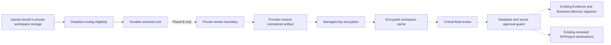

# Document Extraction Production Foundation - Phase A

## Scope

Phase A adds an inert, durable foundation for a future guarded document-extraction pilot. It introduces persistent jobs, workspace-scoped identity, encrypted-cache storage contracts, review authority, quota accounting, operational switches, transactional RPCs, and fail-closed promotion guards.

No NVIDIA worker, provider call, customer activation, photo capture, or extraction UI is part of this phase. The existing CSV/XLSX parser, native file analysis, Business Notes, Evidence Engine, Business Memory, KPI imports, deterministic intelligence, Business Health, `IntelligenceSnapshotV1`, Trust, and Saved Analyses keep their current behavior.

## Authority Boundary

- A future NVIDIA integration may extract document content only.
- Luna may classify an extraction and propose semantics only.
- Neither extraction nor classification creates business truth.
- Deterministic validation and an authorized owner, admin, or manager decide whether all critical fields are resolved.
- Unapproved extraction output cannot be embedded, indexed, imported, written as KPI data, or included in authoritative intelligence.
- Review events, job telemetry, encrypted cache entries, and review snapshots are not Evidence, Business Memory, retrieval content, AI context, or Saved Analyses.

## Inert Flow

The dotted portion is unavailable in Phase A. All system switches default to false, no workspace receives a settings row, the application imports no execution adapter, and there is no provider runtime.

## Data Relationships

- `document_extraction_system_state` is a singleton global kill switch and circuit-state record. Its three execution switches default to false.
- `document_extraction_workspace_settings` holds future entitlement, allowed classes, a finite monthly page budget, and a one-job concurrency limit. Absence means disabled and not entitled.
- `document_extraction_jobs` owns durable workflow state and has one workspace-scoped cache identity.
- `document_extraction_file_bindings` lets duplicate file records in the same workspace reuse one extraction artifact without cross-workspace reuse.
- `document_extraction_cache` stores ciphertext, AES-GCM envelope metadata, version provenance, and fingerprints. It has no plaintext payload column and no client read grant.
- `document_extraction_reviews` stores bounded structured decisions and counts, not duplicate document content.
- `document_extraction_events` is privacy-safe, append-only operational history.

## Job Lifecycle

Jobs move through `queued`, `processing`, `needs_review`, and a terminal state. Enqueueing takes a workspace-scoped HMAC/cache key and reserves quota atomically. Claiming uses `FOR UPDATE SKIP LOCKED`, a bounded lease, and a one-active-NVIDIA-job partial unique index.

Every successful enqueue or same-workspace duplicate binding atomically marks the source file as extraction-controlled. That pending marker makes the existing evidence-index boundary fail closed before chunking or embedding. Authorized approval replaces it with the exact job, review, artifact, classification, and review-version envelope for all files bound to that approved extraction.

An expired lease may be reclaimed only before dispatch. An expired lease after dispatch becomes `dispatch_unknown`; it cannot silently call the provider again. Dispatch atomically converts reserved pages to consumed pages. Pre-provider failure releases reserved pages. Cache hits and duplicate reuse reserve and consume zero pages.

Completion accepts only an AES-256-GCM ciphertext envelope. It cannot accept a plaintext normalized payload. A future classification fingerprint must be bound to the same artifact before approval. Failed jobs require an explicit safe retry and cannot retry after an ambiguous or known dispatch.

## Review Lifecycle

Review states are `pending`, `in_review`, `approved`, `approved_with_corrections`, `rejected`, `unresolved`, `stale`, and `invalidated`. Critical decisions are `confirmed`, `corrected`, `rejected`, or `unresolved`.

Only active workspace owners, admins, and managers may mutate reviews through the reviewed RPC. Approval requires:

- a completed normalized extraction awaiting review;
- a matching file binding, artifact fingerprint, and classification fingerprint;
- the current review contract version;
- no rejected or unresolved critical fields; and
- a non-invalidated encrypted cache artifact.

The database trigger on `business_memory_chunks`, `kpis`, and `operational_metrics` detects files bound to the extraction workflow and requires the complete approval envelope. Existing rows and files without extraction bindings retain their current behavior.

## Identity and Encryption

The content identity is a keyed HMAC over a SHA-256 content digest, workspace ID, and identity version. The cache key additionally includes route, document class, provider, model revision, client revision, routing policy, extraction contract, and normalization version. Filenames and file sizes are never authoritative identity.

The cache contract requires AES-256-GCM, a 96-bit nonce, a 128-bit authentication tag, a versioned managed key, and an authenticated-data digest bound to workspace and cache identity. Phase A intentionally supplies no encryption implementation or fallback key. Phase B must provide managed key encryption and rotation before any worker can complete a job.

## RLS and Grants

Workspace members may select their workspace's settings, jobs, bindings, reviews, and events. They receive no direct insert, update, or delete grants. They cannot read cache ciphertext or global system state.

Review and enqueue RPCs verify `auth.uid()` and active workspace membership. Review mutation additionally verifies an owner, admin, or manager role. Worker RPCs are limited to `service_role`, have no direct table grants, and enforce status, lease, quota, fingerprint, circuit, and kill-switch invariants. Phase B must place them behind an authenticated signed broker rather than expose a service key to a worker client.

## Current Ingestion Compatibility

- CSV/XLSX continues through the deterministic workbook parser and existing staged import review.
- Existing native file analysis explicitly selects `existing_native_file_analysis` authority and does not query the new tables.
- Future extraction-derived file analysis must supply a reviewed document-extraction envelope before chunking or embeddings.
- Business Notes remain contextual and use their separate approval/indexing lifecycle.
- Saved Analyses and generated artifacts never enter document-extraction authority.

This compatibility split avoids a deployment-order dependency: merging inert application contracts before a Production migration does not query missing Phase A tables during current ingestion.

## Failure and Rollback

All missing settings and switches fail closed. Invalid identities, stale reviews, invalidated cache entries, quota exhaustion, unauthorized roles, and cross-workspace references are denied. Operational events contain only IDs, reason codes, counts, stages, and fingerprints; they contain no source text or extracted values.

Rollback is to keep all switches false, remove any future worker, and revert application references. The additive tables may remain without changing current ingestion. No migration rollback should drop historical job, review, or event records after a pilot begins.

## Phase B Prerequisites

Phase B must not begin until all of the following are reviewed:

1. A private, pinned Python worker using the official extraction client.
2. A signed broker that provides narrow claim, file-download, heartbeat, completion, and failure operations.
3. A managed key provider, rotation procedure, retention policy, and recovery test.
4. Provider DPA, retention, region, deletion, and incident terms.
5. A field-level review surface bound to the Phase A review contract.
6. Binding-aware approval checks enabled before every future embedding, import, and authoritative write.
7. Explicit finite quotas based on authoritative pricing.
8. Preview concurrency, circuit-breaker, ambiguous-dispatch, privacy, and kill-switch qualification.

No Production entitlement or provider-execution switch may be enabled as part of Phase A.
