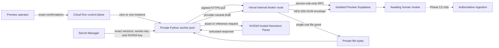

# Document Extraction Worker Deployment and Synthetic Qualification - Phase C1

## Status and scope

Phase C1 operationalizes the private REST document-extraction worker introduced
by Phase B. It does not add a customer extraction route, enable customer
uploads, entitle a workspace, or make extraction authoritative. The retained
deployment configuration is inert: the worker pool has zero instances and all
worker/provider/synthetic switches are false unless an operator opens one
bounded Preview qualification window.

Repository baseline for this work:

- `origin/main`: `fa86e156730550afc85c316927fe48e3a2b2c5c0`
  (tree `f0c55958fee802b4fe2e51e30c4d1949f44ff98b`)
- Phase A / PR #263 merge: `f8ee2b7258cf3e7a092b870f7e55032946dbe7b5`
  (tree `e0c79d631b1ac139eba4f737795b97ef23943633`)
- Phase B / PR #264 merge: `fa86e156730550afc85c316927fe48e3a2b2c5c0`
- isolated Preview Supabase project: `zfpnhvcmuuvtswttmnjd`
- Production Supabase project: `mdiianhfrojmxqpwrflh`, untouched by Phase C1

The isolated Preview migration ledger already contains the canonical Phase A
and Phase B migrations. The Phase C1 protocol migration is additive and may be
applied only to that isolated Preview project during qualification. Its remote
ledger timestamp may differ from the repository filename because the managed
migration runner assigns the remote version; migration name and SQL content are
the canonical identity.

## Deployment target

The selected target is a Google Cloud Run Worker Pool running the pinned Python
3.12 worker container. A worker pool is a continuous background process rather
than a browser- or request-lifetime function. The process polls the broker,
runs one job at a time, exposes only local platform health probes, and can be
manually scaled between zero and one instance. Each deployment uses an
immutable image digest and a deployment-bound worker identity. Cloud Run
revisions provide replacement and rollback; Secret Manager injects exact
secret versions without placing values in the manifest.

The worker pool has no load-balanced URL. It therefore exposes no public or
private extraction ingress. Communication is worker-to-broker over HTTPS. The
Vercel broker route is internet-reachable infrastructure, but it is not a
customer API: every operation requires a short-lived Ed25519 assertion bound
to method, request target, request body, worker identity, key version,
environment, deployment, timestamp, and nonce. The broker consumes the nonce
once in the database before serving an operation.

Rejected alternatives:

- A Vercel function or browser request was rejected because a multi-page job
  must survive normal request and browser lifetimes.
- A Cloud Run Service was rejected because it creates an inbound service URL
  that the extraction runtime does not need.
- The earlier Vercel Workflow worker was removed because it mixed worker
  runtime and web deployment boundaries.
- The full local NeMo Python graph was rejected after its unresolved
  supply-chain advisories; the supported hosted REST profile needs only the
  minimal pinned HTTP/rendering runtime.
- A self-managed VM or Kubernetes cluster was rejected for Phase C1 because it
  adds unnecessary patching, ingress, scheduling, and secret-management burden
  to a single-concurrency Preview qualification.

Official platform references used for the deployment contract are the Cloud
Run Worker Pools deployment, manual scaling, health probe, Secret Manager,
in-memory volume, and logging guides. Operators must re-check current CLI and
platform documentation before running these commands because Worker Pools are
separately versioned from Cloud Run Services.

## Topology and authority boundary

NVIDIA extracts only. The worker cannot read or write Supabase, Storage,
encryption keys, Business Memory, Evidence, KPIs, Business Health, or
`IntelligenceSnapshotV1`. The broker validates identity, owns database access,
encrypts normalized drafts, and stops successful work at `awaiting_review`.
Neither Phase C1 nor its synthetic qualification supplies a promotion path.

## Gates and bounded activation

Provider execution requires all of the following at the relevant boundary:

- application private-worker gate;
- application provider-execution gate;
- database global worker gate;
- database global provider-call gate;
- closed provider circuit;
- workspace settings row;
- workspace entitlement and enablement;
- positive available page quota;
- allowed document class;
- exact provider/model/client/parser policy;
- valid active lease and single-use dispatch/retry claim;
- valid deployment-bound worker assertion;
- and, for this qualification, both application and worker synthetic gates.

Production additionally requires the explicit Production approval contract.
Phase C1 neither supplies nor changes that approval. Missing configuration,
settings, quota, entitlement, or identity fails closed.

The worker rechecks the database gate and renews its five-minute lease before
each `asset_create`, `asset_upload`, and `inference` boundary. The initial claim,
file-grant issue and consume, provider authorization, normalization,
encryption/cache completion, and review promotion retain their Phase A/B
transactional guards. A closed gate prevents new provider execution. Cleanup
may continue after a gate closes so that local and NVIDIA assets can be removed.

## Private broker authentication

Protocol `document_extraction_broker_v2` uses canonical JSON and Ed25519. The
worker assertion lifetime is bounded; timestamps outside the accepted window,
unknown keys, wrong identities, wrong deployment/environment, changed method,
changed target, changed body, and replayed nonces are denied before broker work.
The database assertion record is unique by worker, key version, and nonce hash.

The broker returns a separately signed, short-lived lease capability for job
operations. Up to three broker capability keys are accepted during rotation,
with one configured current version. Capabilities bind the job, worker, lease,
environment, deployment, and expiration. A provider-boundary check returns a
new capability only after the database confirms that the same lease is still
eligible.

Direct browser access has no worker private key and cannot create a valid
assertion. The worker HTTP client disables redirects and ambient proxy
inheritance. The worker pool itself has no URL, so there is no public extraction
surface to probe or reuse.

## Secrets and environment scope

Worker Secret Manager access is limited to three exact Preview secret resources
during the bounded qualification window:

| Secret | Scope | Consumer | Readback policy |
| --- | --- | --- | --- |
| Ed25519 PKCS#8 private key | isolated Preview worker revision | worker only | exact version reference; never printed or read back by scripts |
| Deployment-scoped Vercel Shareable Link token | one immutable PR Preview deployment, maximum one hour | worker broker bootstrap only | exact version reference; revoked and destroyed immediately after qualification |
| NVIDIA API credential | isolated Preview worker revision | worker only | exact version reference; never printed or read back by scripts |

The runtime service account must have no project-level role. It receives
`roles/secretmanager.secretAccessor` only on those three secret resources during
qualification. The Vercel grant and secret version are removed during mandatory
cleanup. It has
no database, Supabase, bucket, cache-encryption, KMS, broker-authority, or
unrelated cloud credential. Startup rejects known forbidden credential names,
including public/anonymous Supabase keys, even if injected accidentally.

The Vercel credential is a URL/deployment-specific Shareable Link created only
for the final immutable PR deployment with a TTL no greater than 3,600 seconds.
It is not the project-wide Protection Bypass for Automation, is never stored in
Vercel environment variables, and cannot be used by Production or unrelated
Preview deployments. The worker accepts it only when both synthetic Preview
gates are true, the runtime environment is `preview`, and the broker origin is
an immutable `vercel.app` deployment rather than a moving Git branch alias. It
uses the credential for one same-origin cookie bootstrap per broker client,
rejects cross-origin redirects and insecure cookies, clears cookies at close,
and never sends the credential or cookie to NVIDIA.

The Vercel Preview broker may hold only the public worker-key record, broker
capability keyring/current version, telemetry HMAC secret, managed cache
encryption keyring/current version, exact runtime policy, and its existing
server-side database access. These values are Preview-scoped. Production worker
identity and NVIDIA secrets remain unprovisioned in Phase C1.

No provisioning command prints secret values, fingerprints secret material, or
retrieves a stored secret. The operator supplies secret values through mode
`0600` files, provisions an exact version, records only the returned version
number, and destroys the local files after verification.

## Rotation and emergency revocation

### Worker identity

1. Keep worker and provider gates false and the pool at zero instances.
2. Generate a new deployment-bound Ed25519 key pair into an operator-controlled
   mode `0700` directory with mode `0600` files.
3. Add the private key as a new exact Secret Manager version.
4. Add the new public record to the Preview broker keyring while retaining the
   prior public record for the bounded overlap.
5. Deploy an immutable worker revision bound to the new key and deployment.
6. Verify signed health and replay denial, then run a zero-provider dry claim.
7. Retire the prior broker public record and disable the prior secret version.

Emergency revocation reverses steps 4 and 7 immediately, disables broker and
worker/provider gates, and scales the pool to zero. Any processing lease is
allowed to expire and is recovered through the controlled lease procedure; it
is never silently reclaimed after dispatch.

### Broker capability signing

1. Add a new random key under a new version to the Preview keyring.
2. Keep no more than the current and two prior keys.
3. Make the new version current; issue new capabilities only with it.
4. Confirm prior unexpired capabilities validate during the overlap.
5. After their maximum lifetime, remove the oldest version.

Missing, unknown, malformed, or retired key versions fail closed. Rotation does
not change worker identity or cache encryption.

### Cache encryption

The broker encrypts using the current managed AES-256-GCM key and a fresh
96-bit nonce. It may decrypt with the current key and up to two prior versions.
Re-enveloping decrypts inside the broker boundary, creates a fresh nonce and
authentication tag under the current key, verifies the authenticated-data
binding, and transactionally replaces only the encrypted envelope metadata.
The worker never receives these keys or plaintext cache rows.

Retire an old key only after every retained envelope has been re-enveloped and
verified. An unknown/retired version, duplicate nonce, failed authentication,
or missing key blocks completion and review. Emergency encryption-key
revocation disables provider execution and review promotion until affected
envelopes are re-enveloped or invalidated through a separately reviewed
operator action.

## Resource and concurrency controls

- Worker Pool manual instances: zero by default, exactly one during the bounded
  qualification; no uncontrolled autoscaling.
- Worker concurrency: one serial poll loop and one active job globally.
- Database concurrency: one active NVIDIA job per workspace, transactional
  claim using row locking, and dispatch/retry claims that are single-use.
- CPU and memory: one vCPU and 2 GiB.
- Temporary storage: a 768 MiB in-memory `emptyDir` mounted as the worker
  `TMPDIR`; startup requires at least 256 MiB free.
- Inputs: at most 25 MiB and 16 pages; source images at most 40 million pixels.
- Rendered output: at most 1664 x 2048, 12 MiB per page, and 120 MiB total.
- Renderer isolation: child process, null stdin, minimal environment, bounded
  stdout, discarded stderr, 45-second timeout, and POSIX CPU/memory/file limits
  where supported.
- Provider HTTP: finite connect/read/write/pool timeouts, no redirect following,
  no ambient proxies, at most one broker-authorized retry, and never a retry
  after an ambiguous dispatch.

Temporary paths use mode `0700`; files use mode `0600`. Source bytes are deleted
after rendering. The complete run directory is removed on success, handled
failure, timeout, termination signal, and startup scavenging. The health probe
fails if an active worker stops making progress for its bounded liveness window.

## Health, monitoring, and privacy

Cloud Run calls `/startup` until configuration, resources, stale-directory
cleanup, and broker health succeed. `/health` reports process readiness and
liveness only; it contains no job, workspace, source, or provider content.

Cloud Logging receives allowlisted structured fields only: event, severity,
deployment/runtime versions, status and content-free failure code, broker and
provider connectivity class, page/call/retry counts, bounded latency, circuit
state, cleanup results, and cost-rate version. The database's existing
append-only telemetry retains the corresponding job-level operational counts.

Logs and telemetry must never contain document text, extracted values,
filenames, images, workspace/user/customer identifiers, URLs, asset IDs,
assertions, keys, tokens, prompts, provider request/response bodies, or plaintext
cache material. The signal summarizer emits counts by approved event and
severity and never returns raw payloads.

Operator alerts or explicit critical signals are required for three consecutive
broker failures, worker startup/internal failure, circuit open, ambiguous
dispatch, lease starvation, provider schema change, NVCF cleanup failure,
temporary cleanup failure, and missing/invalid configuration. During the
qualification window, any critical signal stops new claims and begins cleanup.

## Operator recovery runbook

All recovery starts by recording the bounded time window, deployment ID,
content-free job/run count, and circuit state. Never copy raw provider or source
content into an incident system.

| Incident | Operator sees | Provider may have occurred? | Safe action | Retry / manual review / duplicate proof |
| --- | --- | --- | --- | --- |
| Worker unavailable | zero ready instances, startup/liveness failure | Only if a job was already dispatched | Disable provider/worker gates, scale to zero, inspect content-free signals, roll back to a known digest | Retry only pre-dispatch or after the durable outcome permits it; inspect dispatch request and provider-call count for uniqueness |
| Broker unavailable | signed health or poll fails, backoff increases | No for a new poll; possibly for an active dispatch | Keep database provider gate closed until broker recovers; do not bypass broker | Active post-dispatch work requires manual state review; compare dispatch identity and outcome ledger before retry |
| Provider unavailable | bounded HTTP failure or connectivity class | Yes when dispatch was accepted or ambiguous | Let the durable outcome/circuit policy classify it; close qualification gates | Retry only when the stored class explicitly permits one broker-authorized retry; ambiguous means no retry and manual review |
| Circuit open | runtime reason is circuit-open and new dispatch is denied | Prior calls may have occurred | Keep it open, inspect privacy-safe failures, resolve provider/root cause | Reset only through the reviewed operator path; verify no open dispatch ambiguity first |
| Ambiguous dispatch | `dispatch_unknown`, circuit opens | Yes | Disable execution and investigate provider-side request outcome without replaying the source | No automatic retry; manual review mandatory; dispatch request identity and provider-call count prove no second authorization |
| Stuck lease | processing job with expired heartbeat/lease | Depends on stage | Pre-dispatch lease may be reclaimed once by canonical claim logic; post-dispatch becomes ambiguous | Never manually steal an active lease. Compare stage, dispatch timestamp, request ID, and outcomes before recovery |
| Failed heartbeat | liveness degrades or boundary renewal fails | Possibly | Stop the worker; preserve state; let lease expiry classification run | Retry follows lease/stage rules only; manual review for post-dispatch expiry |
| NVCF cleanup failure | cleanup failure/ambiguous signal | Yes | Disable execution, run the bounded dry-run cleanup for the recorded two-hour window, then use the exact delete confirmation | No extraction retry until cleanup outcome is known; compare asset-operation count and dispatch record without logging IDs |
| Encryption failure | completion fails closed | Provider call already completed | Preserve prior valid artifact; disable further dispatch if systemic; repair broker key availability | Provider call is not repeated. Re-envelop only through managed-key procedure; manual review remains blocked |
| Key rotation failure | new revision fails auth/decrypt/startup | Normally no if gates stayed closed | Return current key version/revision, revoke failed new version, verify old path | No provider retry. Compare key/deployment versions and single-use assertion counts |
| Malformed provider output | validation failure or schema-change signal | Yes | Preserve no raw response, fail the job, stop qualification if contract changed | Retry only if existing policy explicitly classifies a proven safe case; manual review cannot approve malformed output |
| Temporary cleanup failure | local cleanup signal or stale directory on startup | Possibly | Scale to zero; let instance termination destroy in-memory volume; verify next startup scavenging | Do not dispatch new work until cleanup is clean; use dispatch/outcome ledger to exclude replay |
| Emergency shutdown | operator or alert declares unsafe state | Maybe | Close application and database provider gates first, then all worker/synthetic gates, scale pool to zero, revoke worker/NVIDIA secrets if compromised | Never force a retry. Review all processing and `dispatch_unknown` rows before reopening |

If the application broker gate is already off, the worker cannot report a final
failure; the lease is deliberately left for controlled expiry rather than
bypassing authentication. Prefer closing the database provider gate while the
broker remains available long enough to record a denied boundary and safe
failure, then close the broker and scale down.

## Kill-switch drill

Before any provider credential is reachable by a running worker, execute the
following matrix with provider call count fixed at zero. Each row is tested
independently and restored to false/disabled afterward.

| Gate | Intake | Claim | Grant issue/consume | Asset create/upload | Inference / immediate pre-call | Normalize/cache | Review |
| --- | --- | --- | --- | --- | --- | --- | --- |
| Application global/private-worker | deny | deny broker operations | deny | deny | deny | deny | existing guard remains |
| Database global worker | ineligible | deny | deny | deny at boundary | deny | deny | deny stale/ineligible |
| Application provider execution | no executable route | deny broker health/operations | deny | deny | deny | deny | no promotion change |
| Database provider calls | ineligible | deny | deny | deny at boundary | deny | deny | deny stale/ineligible |
| Worker private-worker gate | process fails closed | no poll | none | none | none | none | none |
| Worker provider gate | process fails closed | no poll | none | none | none | none | none |
| Synthetic qualification gates | no fixture intake | no synthetic claim | deny | deny | deny | deny | never grants authority |
| Workspace enable/entitlement | deny | deny | deny | deny at boundary | deny | deny | deny |
| Quota zero/absent | deny/reserve none | deny | deny | deny at boundary | deny | deny | deny |
| Document class not allowed | deny | deny | deny | deny at boundary | deny | deny | deny |
| Circuit open | deny | deny | deny | deny at boundary | deny | deny | deny |

After each boundary denial, verify the provider-call counter and dispatch
outcome ledger did not increase. For the three provider boundaries, also verify
that no renewed lease capability was returned. Cleanup remains callable only
through its bounded operator/worker path and cannot initiate inference.

## Synthetic Preview qualification

Qualification is permitted only after local validation, Preview migration
review, secret-scope verification, inert deployment verification, health,
broker-authentication, rotation, and kill-switch drills pass.

1. Confirm Supabase reference `zfpnhvcmuuvtswttmnjd`, the exact immutable
   non-Production Vercel Preview deployment, the isolated GCP project/region,
   and exact operator phrases. Prove the deployment-scoped Vercel credential is
   rejected by Production and unrelated Preview deployments before opening any
   execution gate.
2. Apply only `20260804010000_document_extraction_worker_phase_c1_protocol.sql`
   through the canonical Preview migration workflow after checking the ledger.
3. Build the pinned image and deploy its digest at zero instances with all four
   worker gates false. Bind the broker to the immutable Preview origin and the
   exact-version temporary Vercel share secret. Verify identity, env allowlist,
   secret references, probes, resources, no URI, and zero instances without
   reading secrets.
4. Seed or enqueue only the twelve committed synthetic fixture IDs. Arbitrary
   uploads, paths, customer files, and customer routes remain unavailable.
5. Open the application/database synthetic qualification window, then use the
   exact worker confirmation to set one instance and four worker gates true.
6. Process the frozen 12-document/13-rendered-page corpus once. One intentionally
   corrupt fixture fails locally, so the provider page-call upper bound is 12.
7. Aggregate only content-free synthetic records and worker/database counters.
8. Close application and database gates, disable/scale the pool to zero, clean
   NVCF assets in the bounded run window, and remove all temporary rows/files.

The aggregate report records documents/pages attempted, provider calls and
successes, authentication failures, timeouts, retries, ambiguous dispatches,
NVCF asset-page use and cleanup, p50/p95/p99 latency, renderer/response/
normalization/encryption failures, cache result counts, circuit behavior,
word/character error, numeric/sign/decimal/currency/reporting-period accuracy,
page/bounding-box accuracy, catastrophic business-error rate, and class-level
recommendations. Cost is reported as unknown unless an authoritative price is
available; pages and calls are always recorded.

The final retained report may contain only aggregate values, contract/version
identifiers, fixture counts, and class labels. It must not include fixture text,
raw NVIDIA bodies, asset identifiers, signed URLs, database identities, or
secrets.

## Post-qualification cleanup

Cleanup is mandatory even when qualification fails:

1. Close application synthetic/provider gates and database worker/provider
   gates before any further claim can begin.
2. Set all four worker gates false and scale the pool to zero.
3. Verify the pool is inert, no active lease remains, and circuit state is safe.
4. Run NVCF cleanup first as a dry run for the bounded two-hour window, then use
   the exact deletion confirmation for matching Vaeroex PNG assets only.
5. Remove synthetic jobs, assertions, grants, operational telemetry fixtures,
   reviews, bindings, cache envelopes, intake rows, and temporary qualification
   configuration in dependency-safe order. Retain only the approved aggregate
   content-free report.
6. Revoke the exact Vercel Shareable Link without regeneration, destroy its
   temporary Secret Manager version, remove its per-secret IAM grant, and
   restore the prior known inert Worker Pool revision at zero instances. Delete
   local mode `0600` credential/identity inputs, temporary manifests, logs, and
   rendered files.
7. Confirm no customer workspace setting or entitlement exists, no Production
   resource changed, and no extraction became Evidence, Business Memory, KPI,
   Business Health, or snapshot input.

## Deployment and rollback commands

The operator scripts require
`PHASE_C1_PREVIEW_CONFIRMATION=vaeroex-document-extraction-phase-c1-preview-only`.
The one-instance script additionally requires
`QUALIFICATION_CONFIRMATION=synthetic-preview-only-12-documents-13-pages`.
They validate immutable image digests, exact secret versions, non-Production
broker origin, and expected gate/instance state.

Normal rollback is forward and non-destructive:

1. Close application/database execution gates.
2. Run `ops/disable-preview-worker.sh` to set worker gates false and instances
   to zero.
3. Replace the pool with the prior known immutable image manifest if needed,
   still at zero instances.
4. Revoke the affected worker public record and secret versions for compromise.
5. Preserve jobs, events, encrypted cache, reviews, and migration history until
   controlled synthetic cleanup or historical retention review.

The Phase C1 migration has no down migration because it preserves historical
protocol V1 rows and only expands the named version constraint, replaces the
claim function with exact V2 provenance, and adds a service-role-only provider
boundary check. A rollback of function behavior requires a separately reviewed
forward migration, not ad hoc Production SQL.

## Qualification record

Live qualification is deliberately not claimed by repository code. Record the
following only after the isolated Preview deployment and bounded run complete:

- GCP project/region and Worker Pool deployment/revision ID;
- immutable image digest;
- Vercel Preview deployment ID and origin;
- Preview migration ledger entry;
- privacy-safe aggregate synthetic result;
- provider-call and NVCF cleanup counts;
- kill-switch drill result;
- final zero-instance/gates-off verification; and
- confirmation that Production remained untouched.

Until those fields are completed from authoritative platform evidence, Phase
C1 is implemented locally but deployment qualification remains pending.

## Phase C2 prerequisites

Phase C2 must not begin until:

- Phase C1 deployment and synthetic quality/adoption gates pass;
- no unresolved provider schema, cleanup, circuit, identity, or privacy signal
  remains;
- authoritative provider pricing and customer quota policy are approved;
- provider retention, region, DPA, and deletion terms are approved;
- the field-level review UI is built against the existing review contract;
- owner/admin/manager authorization and unresolved-critical-field blocking are
  requalified end to end;
- approved extraction promotion is proven to enter existing ingestion only
  after review; and
- a separate founder/admin-only Preview-to-Production rollout review approves
  Production secrets, environment scope, monitoring, rollback, and one
  explicitly entitled workspace.

Customer uploads, arbitrary images, public routes, Production provider calls,
automatic authority, and background activation remain outside Phase C1.
