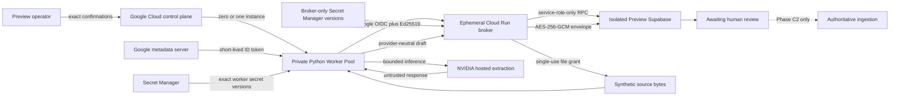

# Document Extraction Worker Deployment and Synthetic Qualification - Phase C1

## Status and scope

Phase C1 operationalizes the private REST document-extraction worker introduced
by Phase B. It does not add a customer extraction route, enable customer
uploads, entitle a customer workspace, or make extraction authoritative. The
retained deployment is inert: the existing Cloud Run Worker Pool has zero
instances and every worker, provider, and synthetic gate is false.

The bounded qualification uses a dedicated ephemeral Cloud Run broker service.
It leaves ordinary Vercel Preview protection and Vercel Production unchanged.
The broker and worker are connected only through Google IAM/OIDC and the
existing Vaeroex Ed25519 broker assertion.

Repository and environment boundaries:

- branch: `codex/document-extraction-worker-deployment`
- Draft PR: `#265`
- isolated GCP project: `vaeroex-document-worker`
- isolated region: `us-west1`
- isolated Preview Supabase project: `zfpnhvcmuuvtswttmnjd`
- Production Supabase project: `mdiianhfrojmxqpwrflh`, never addressed
- frozen corpus: 12 synthetic documents and 13 rendered pages
- expected provider attempts: 12; absolute architectural ceiling: 24

The Preview migration ledger contains the canonical Phase A and Phase B
migrations. The Phase C1 protocol migration is additive and may be applied only
to the isolated Preview project through the canonical migration workflow.

## Deployment targets

### Existing Worker Pool

The Python worker runs in a Google Cloud Run Worker Pool. A Worker Pool is a
continuous background process rather than a browser- or request-lifetime
function. The process polls one broker, handles one job at a time, exposes only
local platform health probes, and is manually scaled between zero and one
instance. It has no load-balanced URL and no extraction ingress.

Each qualification worker revision uses:

- an immutable container image digest;
- a deployment-bound Ed25519 identity;
- the existing runtime service account;
- exact Google Secret Manager versions;
- one vCPU and 2 GiB memory;
- a bounded in-memory temporary volume;
- serial execution; and
- all gates false by default.

### Ephemeral broker service

The qualification broker is a broker-only Cloud Run service named for the PR
and source commit, such as `vaeroex-doc-broker-pr265-<commit>`. It exposes only
`/api/internal/document-extraction/broker`, has no UI, and has no arbitrary
extraction endpoint.

The service uses:

- an immutable image digest built from the exact PR head;
- a pinned Node builder and pinned non-root distroless Node runtime;
- one `@vercel/ncc` server bundle plus the pinned `server-only` sentinel, with
  no Next.js, Sharp, or PostCSS runtime graph;
- minimum instances zero, maximum instances one, and request concurrency one;
- a dedicated service account with only exact secret access;
- no unauthenticated invoker;
- a service-level `roles/run.invoker` grant only for the worker service account;
- explicit `preview` runtime policy injection;
- only isolated Preview Supabase configuration;
- no NVIDIA credential; and
- privacy-safe platform logging.

The service, its service account, its service-level IAM binding, and its
temporary secret versions are removed after qualification. The original inert
Worker Pool and its approved long-term Preview secrets remain.

## Shared broker implementation

The Vercel route and Cloud Run route are thin adapters around one server-side
`Request -> Response` handler:

- `lib/document-extraction/broker-http.ts` owns request bounds, Ed25519
  authentication, replay consumption, file-grant consumption, broker operation
  dispatch, and bounded responses.
- `lib/document-extraction/broker-service.ts` owns the canonical broker
  operations, lease validation, claim/grant behavior, provider authorization,
  outcome handling, encryption completion, and telemetry.
- the Vercel route injects the actual Vercel runtime environment;
- the Cloud Run route requires an explicit broker runtime environment; and
- neither adapter duplicates or reimplements broker policy.

The Cloud Run service cannot spoof `VERCEL_ENV`. Missing, malformed, or
Production runtime configuration fails closed.

## Topology and authority boundary

NVIDIA extracts only. The worker cannot read or write Supabase, Storage,
encryption keys, Business Memory, Evidence, KPIs, Business Health, or
`IntelligenceSnapshotV1`. The broker validates identity, owns database access,
encrypts normalized drafts, and stops successful work at `awaiting_review`.
No Phase C1 path can promote an extraction into authoritative data.

## Two-layer broker authentication

### Layer 1: Google IAM/OIDC

The Worker Pool obtains a Google-signed ID token from the Cloud Run metadata
server. The token audience is the exact ephemeral broker origin. The token is:

- requested with `Metadata-Flavor: Google`;
- sent in `X-Serverless-Authorization` so `Authorization` remains available for
  Vaeroex file capabilities;
- cached only in worker memory until shortly before expiry;
- never persisted or logged; and
- rejected by Cloud Run when its identity, audience, issuer, signature, or
  lifetime is invalid.

No service-account key is created or downloaded. The runtime service account
receives `roles/run.invoker` on the exact ephemeral service only, not at project
scope. Future branches and unrelated services receive no inherited access.

### Layer 2: Vaeroex Ed25519 assertion

Protocol `document_extraction_broker_v2` remains mandatory after Cloud Run IAM.
The assertion is bound to:

- exact worker identity and key version;
- explicit Preview environment;
- immutable worker deployment ID;
- HTTP method and complete request target;
- request body digest;
- timestamp and 60-second lifetime; and
- a single-use nonce consumed in the database.

A valid Google token cannot bypass Ed25519. A valid Ed25519 assertion cannot
bypass Cloud Run IAM. Wrong environment, deployment, method, target, body,
timestamp, nonce, or key fails closed before a claim, file grant, or provider
authorization.

## Secret and IAM scope

The running worker may access only the existing exact Preview NVIDIA secret
version and the exact qualification worker private-key version. It receives no
Supabase, broker capability, telemetry, or cache-encryption secret.

The ephemeral broker service account may access only temporary exact versions
for:

| Secret | Broker use |
| --- | --- |
| Preview Supabase service role | internal isolated Preview RPC and Storage access |
| worker public-key record | Ed25519 verification |
| broker capability keyring | lease and single-use file capabilities |
| telemetry HMAC | privacy-safe references |
| cache-encryption keyring | approved AES-256-GCM envelope boundary |

The broker has no NVIDIA key. Before invoking Google Cloud, the provisioner
rejects a candidate Supabase credential unless its bounded JWT payload names
`zfpnhvcmuuvtswttmnjd` and `service_role`. This is a local scope guard, not an
independent signature check; the authenticated source of the credential and
the broker's live connection to the isolated project complete the proof. The
credential is streamed over standard input directly into the provisioner. The
qualification Ed25519 keypair and the capability, telemetry, and encryption
keys are generated in process memory and streamed directly into Secret Manager.
Values are never printed, fingerprinted, or persisted locally. Access is
granted on each secret resource to the broker service account only. Temporary
versions and grants are destroyed during cleanup; the original Preview worker
secret version is explicitly protected from deletion.

Startup rejects known forbidden credentials, including anonymous Supabase
keys, Production approval material, and obsolete web-protection credentials.

## Gates and bounded activation

Provider execution requires every applicable control:

- application private-worker gate;
- application provider-execution gate;
- database global worker gate;
- database global provider-call gate;
- worker private-worker gate;
- worker provider gate;
- synthetic qualification gates at broker and worker;
- closed provider circuit;
- workspace setting, entitlement, and enablement;
- positive available page quota;
- allowed document class;
- exact provider/model/client/parser policy;
- valid active lease and single-use dispatch or retry claim; and
- valid Google and Ed25519 identities.

Production additionally requires a separate Production approval contract,
which Phase C1 neither supplies nor changes. Missing configuration, quota,
entitlement, setting, or identity fails closed.

The worker rechecks the database gate and renews its lease before every provider
boundary. Closing a gate prevents new provider execution while preserving the
bounded cleanup operations needed to terminate safely.

## Authentication qualification with zero provider calls

Before any provider or synthetic gate opens, the broker enters authentication
mode: private broker enabled, provider disabled, and both synthetic provider
gates disabled. The worker enters a matching authentication mode that opens a
live broker client, proves metadata-token and Ed25519 access, emits one
content-free success signal, and never starts the job runner.

The proof covers:

- exact worker service account and exact broker audience;
- valid short-lived ID token;
- valid Ed25519 assertion;
- valid worker environment and deployment binding;
- unauthenticated invocation denial;
- wrong Google identity and wrong audience denial;
- malformed or expired Google token denial;
- missing or invalid Ed25519 denial;
- wrong worker, deployment, environment, method, target, or body denial;
- expired assertion and replayed nonce denial;
- caller-controlled workspace substitution denial; and
- Vercel Production having neither credentials nor IAM permission.

Provider call, dispatch, and file-grant counts must remain zero. Any inconclusive
result stops qualification.

## Live kill-switch drill

With provider execution disabled, test each control independently and restore
it to false afterward:

| Gate | Required denial boundary |
| --- | --- |
| Application private-worker | broker request |
| Database global worker | claim and grant |
| Application provider execution | provider authorization |
| Database provider calls | immediate provider boundary |
| Worker private-worker | startup and polling |
| Worker provider | provider client creation |
| Synthetic qualification | synthetic fixture claim |
| Workspace entitlement and enablement | workspace claim |
| Quota zero or absent | dispatch reservation |
| Disallowed document class | claim and dispatch |
| Open circuit | provider authorization |

After every denial, provider-call and dispatch counters must remain unchanged.
Cleanup remains bounded and cannot initiate inference.

## Bounded synthetic qualification

Qualification begins only after local validation, immutable image verification,
broker IAM proof, zero-provider authentication proof, and the kill-switch drill
all pass.

1. Confirm project `vaeroex-document-worker`, region `us-west1`, Preview
   Supabase reference `zfpnhvcmuuvtswttmnjd`, and exact PR head.
2. Confirm no Vercel environment, deployment protection, Preview, or Production
   configuration was modified.
3. Apply only the canonical Phase C1 protocol migration to isolated Preview if
   the migration ledger does not already contain it.
4. Build broker and worker images from the exact committed PR head and deploy
   immutable digests with broker minimum zero and worker instances zero.
5. Prove Google IAM/OIDC and Ed25519 with provider calls fixed at zero.
6. Complete the kill-switch matrix with provider calls fixed at zero.
7. Seed only the committed synthetic fixture IDs in one isolated synthetic
   workspace. No arbitrary upload or customer file path is available.
8. Open the approved application/database gates, then the broker and worker
   qualification modes, and scale exactly one worker instance.
9. Process the frozen 12-document, 13-page corpus serially. One intentionally
   corrupt fixture fails locally, leaving 11 provider-eligible documents and 12
   expected page inference attempts. The absolute architectural ceiling is 24.
10. Stop immediately on any retry, ambiguous dispatch, auth or isolation
    failure, provider-schema mismatch, unexpected NVCF asset flow, bound
    violation, cross-workspace result, or authority-boundary violation.
11. Confirm every successful extraction stops at `awaiting_review`.
12. Retain only aggregate content-free measurements.

## One-call response-profile diagnostic

The hosted response-contract blocker may be diagnosed once without rerunning
the corpus. This mode remains part of synthetic qualification, but narrows the
worker further:

- the only accepted source is committed fixture
  `synthetic-doc-executive-kpi-review`;
- the fixture must materialize as exactly one committed rendered page;
- its rendered PNG remains below the NVCF asset threshold, so asset creation
  or upload is an immediate stop condition;
- exactly one synthetic job is seeded in one isolated Preview workspace with a
  one-page quota;
- one Worker Pool instance handles the job serially;
- the runner authorizes one initial dispatch and never requests retry
  authorization in diagnostic mode; and
- any missing observer event is classified as inconclusive rather than causing
  a second call.

The diagnostic requires the ordinary Preview synthetic gates plus
`DOCUMENT_EXTRACTION_RESPONSE_PROFILE_DIAGNOSTIC_ENABLED=true` and the exact
confirmation `nemotron-parse-response-profile-one-call-v1`. Worker startup
rejects this mode outside Preview. The checked-in activation script accepts
only project `vaeroex-document-worker`, region `us-west1`, and Worker Pool
`vaeroex-document-extraction-preview`. The broker remains commit-bound,
private, and callable only through service-level Google IAM/OIDC followed by
the existing Ed25519 assertion. It receives only isolated Preview Supabase
configuration. No Vercel share credential or Production resource participates.

Before the call, independently verify the immutable worker and broker images,
authentication matrix, service-account IAM, exact Preview project references,
closed Production paths, one seeded job, one page of quota, and zero prior
dispatches. Open database, broker, workspace, and worker gates only after those
checks pass. A retry, second dispatch, ambiguous state, authorization failure,
provider asset operation, or unexpected fixture stops the run immediately.

The observer executes after the bounded HTTP response is read and before the
unchanged response validator. Observer failure is swallowed. It cannot affect
acceptance, retry classification, normalization, review state, or authority.
It emits only these structural fields:

| Retained field | Bounded representation |
| --- | --- |
| HTTP status and response content type | integer and validated MIME type |
| returned model and finish reason | approved identifiers or bounded structural category |
| assistant content | `null`, `empty`, or `non_empty` only |
| tool calls | count, bounded type, bounded function name |
| tool arguments | transport type, UTF-8 byte length, complete-JSON boolean |
| response shape | allowlisted top-level structural keys |
| completion state | truncation and token-limit indicators |
| provider trace | bounded provider request or trace ID |
| response operation | byte count and latency only |

It never emits document text, extracted values, coordinates, argument contents,
assistant content, raw requests or responses, image bytes, prompts, credentials,
or customer, workspace, or user identifiers. Unknown untrusted model, function,
tool, and response-key strings are omitted or reduced to a fixed category so
they cannot become a content channel. Raw provider content exists only in the
existing in-memory validation path and is not written to disk, database,
telemetry, or operator output.

The operator assigns exactly one structural classification:

1. documented legacy hosted tool-call profile;
2. Nemotron Parse v1.2 tagged-content profile;
3. truncated legacy response;
4. unexpected ordinary assistant-content response;
5. malformed provider response; or
6. still inconclusive.

A v1.2 result does not activate auto-detection or relax the hosted validator;
it requires a separately versioned v1.2 adapter review. A truncated or
malformed result remains rejected and only its provider request ID and
structural classification are carried into any support record.

Cleanup starts immediately after the first terminal provider outcome. Close
database, workspace, broker, provider, synthetic, and diagnostic gates; scale
the Worker Pool to zero; remove the exact diagnostic confirmation; delete the
single synthetic job, source, Storage object, review/cache/event rows, and
ephemeral broker resources; destroy temporary secret versions and IAM grants;
and confirm no NVCF asset or temporary file remains. The retained Worker Pool
must finish at zero instances with every gate false. Only approved content-free
diagnostic metadata may remain in bounded platform logs.

## Measurements

Record only aggregate values:

- documents and pages attempted;
- provider calls and successes;
- authentication failures, timeouts, retries, and ambiguous dispatches;
- latency p50, p95, and p99;
- renderer, validation, normalization, and encryption failures;
- cache hit/miss behavior and circuit behavior;
- word error and numeric, sign, decimal, currency, and reporting-period accuracy;
- page association and bounding-box accuracy;
- catastrophic business-error rate; and
- class-specific outcomes.

Do not retain raw text, values, filenames, images, prompts, provider payloads,
asset IDs, URLs, assertions, tokens, workspace IDs, user IDs, or customer data.
Google cost is measured from the bounded resources. NVIDIA cost remains unknown
unless authoritative account-specific pricing evidence is available.

## Mandatory cleanup and rollback

Cleanup runs after success or any stop condition:

1. Close broker application/provider/synthetic gates and isolated database
   worker/provider/workspace gates before another claim can begin.
2. Set all worker gates false and scale the Worker Pool to zero.
3. Verify no active lease remains and the circuit is in the expected safe state.
4. Verify no unexpected NVCF asset flow occurred. If assets exist, perform the
   bounded dry-run cleanup before any exact confirmed deletion.
5. Remove synthetic jobs, assertions, grants, telemetry fixtures, reviews,
   bindings, cache envelopes, intake rows, files, and storage objects in
   dependency-safe order. Retain only the approved aggregate report.
6. Remove the exact broker `roles/run.invoker` grant and delete the ephemeral
   broker service.
7. Destroy temporary broker secret versions, revoke per-secret IAM grants, and
   delete the ephemeral broker service account after proving it has no remaining
   bindings.
8. Restore the prior known inert Worker Pool revision at zero instances and all
   gates false. Keep the original Worker Pool and approved long-term Preview
   worker/NVIDIA secrets.
9. Remove temporary local manifests, descriptions, logs, and credential files.
10. Confirm no Vercel resource, Production resource, customer workspace,
    deterministic input, or authoritative system changed.

The checked-in cleanup command accepts only the exact PR-bound broker name,
isolated project and region, worker service account, and explicit temporary
worker-secret version. It refuses to destroy the original worker key version.
It never accesses a secret value.

The database migration has no down migration because it preserves historical
protocol V1 rows and only expands protocol provenance and guarded functions.
Any database rollback is a separately reviewed forward migration, never ad hoc
Production SQL.

## Validation

Required validation includes:

- TypeScript and Next.js production build;
- shared-handler adapter parity;
- Cloud Run adapter and deployment-policy tests;
- Google OIDC and Ed25519 tests;
- replay, wrong-audience, and IAM isolation tests;
- kill-switch and zero-provider authentication tests;
- Python compile, strict mypy, pytest, pip check, pip-audit, SBOM, and licenses;
- Phase A, Phase B, and Phase C1 regressions;
- file ingestion, Evidence, Business Notes, KPI semantics, Formula V2,
  Business Health, Explain Finding, `IntelligenceSnapshotV1`, Trust, and Saved
  Analyses regressions;
- security, adversarial, and workspace-isolation checks; and
- `git diff --check`.

## Qualification record

Repository code never claims a live pass. After the bounded isolated run, the
operator record must include:

- exact PR head and immutable broker/worker image digests;
- broker service name and URL without tokens or identifiers from customer data;
- Worker Pool deployment/revision;
- Preview migration ledger entry;
- IAM/OIDC and Ed25519 proof results;
- kill-switch drill result;
- aggregate quality, reliability, latency, page, and call counts;
- aggregate cost evidence;
- cleanup proof; and
- confirmation that Vercel and Production remained untouched.

### Isolated Preview outcome (2026-08-04)

The Cloud Run broker authentication redesign passed its zero-provider
qualification. The exact Preview worker identity reached the private broker
through service-level Google IAM/OIDC and the required Ed25519 assertion.
Unauthenticated access was denied, the bounded authorization matrix passed,
and the live database kill-switch matrix denied all ten guarded states before
returning only the eligible control state.

The synthetic provider qualification then stopped at the first approved hard
failure boundary:

- two one-page synthetic fixtures were attempted;
- the intentionally corrupt fixture failed local validation with zero provider
  calls;
- the first provider-eligible fixture made exactly one inference attempt;
- the provider result was classified as `malformed_output` and rejected with
  `provider_output_incomplete`;
- provider successes, retries, ambiguous dispatches, authentication failures,
  timeouts, and NVCF asset flows were all zero;
- no normalization, encryption, cache, review, or authority-promotion step was
  reached;
- no quality score is reported because no provider result passed the response
  contract; and
- execution stopped before a second provider-eligible fixture was enqueued.

Cleanup completed immediately. Database, workspace, provider, broker, and
worker gates were closed; the Worker Pool was restored to its prior inert
revision at zero instances; synthetic database and Storage fixtures were
removed; the ephemeral broker, seeder, service account, service-level IAM
grant, image, and temporary secrets were deleted; and the temporary worker
signing-key version was destroyed. The original Worker Pool and approved
long-term Preview secrets remain. Vercel Preview, Vercel Production, Supabase
Production, customer workspaces, and customer documents were never modified or
addressed.

This is a provider-contract qualification blocker, not an authentication,
isolation, or authority-boundary failure. Phase C1 must remain disabled until a
separately reviewed change resolves the officially hosted response-contract
mismatch and the complete frozen corpus can be rerun from the beginning.

### Hosted response contract audit

The retained content-free evidence proves that the hosted request received an
HTTP success with JSON content, valid top-level JSON, the expected model, one
choice, and a message object. It then failed the hosted completion-shape guard
before tool-call arguments, elements, or coordinates were inspected. The
original `provider_output_incomplete` code combined two predicates: the finish
reason was not `tool_calls`, the message contained unexpected content, or both.
No retained field distinguishes those cases, so the single historical response
cannot be classified as request error, validator error, provider drift, or
malformed provider output without guessing.

**Classification:** Inconclusive due to insufficient content-free evidence.

NVIDIA's Nemotron Parse 1.5 documentation supports the selected hosted request:
one image, model `nvidia/nemotron-parse`, and one `markdown_bbox` function tool.
Its documented element payload is a JSON list whose bounding boxes use
normalized `xmin`, `ymin`, `xmax`, and `ymax` coordinates. NVIDIA's newer
Nemotron-Parse-v1.2 contract is explicitly different: model
`nvidia/nemotron-parse-v1.2`, control-token text input, tagged assistant content,
and no `markdown_bbox` tool call. NVIDIA's 1.7 release notes state that the API
changed between these model generations. The profiles therefore remain
separate and are never auto-detected or mixed.

The parser now emits a bounded content-free diagnostic code for truncation,
`stop`, missing or other finish states, unexpected tool-call content, and the
specific `stop` plus content profile-mismatch shape. Every case remains a
non-retryable malformed-output failure. No provider response is accepted more
broadly, and raw response content is neither retained nor logged. A future
qualification still requires independent contract review before any provider
call.

### One-call response-profile diagnostic (2026-08-04)

The separately approved one-call diagnostic used only the committed one-page
`synthetic-doc-executive-kpi-review.pdf` fixture. It made exactly one NVIDIA
inference attempt with zero retries. The unchanged hosted response validator
rejected the result before normalization, encryption, cache, review, or any
authority path.

The content-free observer recorded this structural profile:

- HTTP `200` with `application/json`;
- returned model `nvidia/nemotron-parse`;
- `finish_reason` `stop`;
- null assistant content;
- one `function` tool call named `markdown_bbox`;
- string arguments, 1,892 bytes, containing complete valid JSON;
- no truncation or token-limit indication;
- 2,758 response bytes and 1,169 ms response latency; and
- provider support request ID `6cf6e948-8c47-4347-b450-50458387eff7`.

No tool arguments, extracted text or values, bounding boxes, assistant content,
request body, response body, image bytes, prompt, credential, workspace ID, or
customer identifier was retained. The observer ran before, and could not
influence, the unchanged fail-closed validator.

**Classification:** `5. malformed provider response`.

The response matches the documented legacy hosted tool-call profile in every
retained structural respect except its completion marker. The approved hosted
contract requires `finish_reason: tool_calls` when a tool call is returned;
NVIDIA returned `stop` while still returning one complete tool call. This is not
a v1.2 tagged-content response and there is no evidence of truncation. The
standards-compliant next step is to ask NVIDIA whether `stop` is an intentional
hosted Nemotron Parse completion contract, using only the support request ID and
this structural classification. Vaeroex must not accept `stop` without official
contract evidence and a separate adapter review.

Cleanup closed all database and runtime gates, restored the retained Worker Pool
to its prior inert revision at zero instances, removed the synthetic Storage and
database fixtures, deleted the ephemeral broker and secrets, destroyed the
temporary worker signing-key version, and retained only content-free aggregate
telemetry. Production and Vercel resources were not addressed.

## Phase C2 prerequisites

Phase C2 cannot begin until Phase C1 quality and adoption gates pass, all
ephemeral resources are removed, provider retention and pricing are approved,
the field-level review UI is qualified, approval authorization is reverified,
and a separate rollout review approves any Production resource. Customer
uploads, arbitrary images, public routes, automatic authority, and background
activation remain outside Phase C1.
